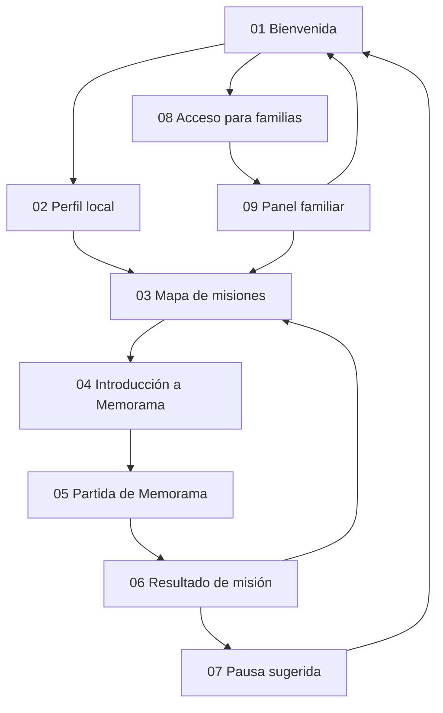
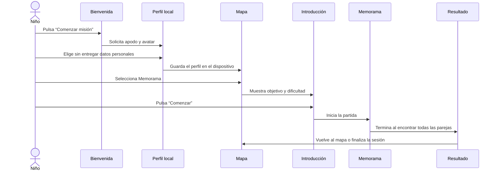
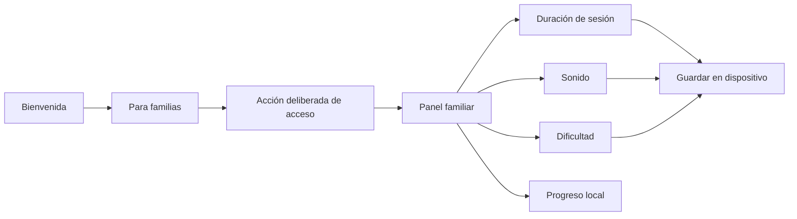

# Mapa de pantallas y recorridos

## Objetivo

Definir la estructura de Chispora antes de programar. El mapa evita crear pantallas aisladas y permite comprobar que el niño siempre sabe dónde está, qué debe hacer y cómo terminar.

## Mapa general

## Inventario de pantallas

| ID | Pantalla | Usuario | Propósito principal |
|---|---|---|---|
| 01 | Bienvenida | Ambos | Presentar Chispora y separar los dos recorridos. |
| 02 | Perfil local | Niño acompañado | Elegir apodo y avatar sin crear una cuenta. |
| 03 | Mapa de misiones | Niño | Elegir una actividad y ver progreso sencillo. |
| 04 | Introducción a Memorama | Niño | Explicar objetivo, habilidad y dificultad. |
| 05 | Partida de Memorama | Niño | Completar el juego con controles claros. |
| 06 | Resultado de misión | Niño | Reconocer esfuerzo, mostrar avance y cerrar la partida. |
| 07 | Pausa sugerida | Niño | Terminar la sesión con una transición amable. |
| 08 | Acceso para familias | Adulto | Evitar la entrada accidental a configuraciones. |
| 09 | Panel familiar | Adulto | Configurar sesión y consultar progreso local. |

## Recorrido del niño: primer uso

## Recorrido del niño: sesión habitual

1. Entra a Chispora.
2. La web reconoce el perfil local y muestra su avatar.
3. Accede al mapa de misiones.
4. Elige Memorama y su dificultad disponible.
5. Completa una partida.
6. Recibe una devolución sobre estrategia y esfuerzo.
7. Regresa al mapa o acepta la pausa sugerida.

No habrá reproducción automática, rachas diarias, conteos regresivos de pérdida ni una pantalla que obligue a jugar otra partida.

## Recorrido del adulto

La acción deliberada reduce entradas accidentales, pero no se describirá como autenticación. Si el producto incorpora pagos o datos sincronizados, deberá reemplazarse por un mecanismo seguro.

## Reglas globales de navegación

- El logotipo vuelve al mapa durante el recorrido infantil y a bienvenida cuando no hay perfil activo.
- Cada juego ofrece “Pausar” y “Salir de la misión”.
- Salir requiere confirmación únicamente si existe progreso de una partida en curso.
- El botón Atrás del navegador debe producir un resultado predecible.
- La zona infantil no muestra precios, compras ni enlaces externos.
- El área adulta siempre ofrece una forma visible de volver a las misiones.
- Los estados importantes se comunican con texto e icono, no solo mediante color.

## Estados que también deben diseñarse

Una pantalla no está completa si solo funciona en el caso ideal. Debemos contemplar:

- Perfil nuevo y perfil existente.
- Sin progreso y con progreso.
- Partida iniciada, pausada, terminada y abandonada.
- Sonido activo y silenciado.
- Pantalla pequeña y orientación horizontal.
- Datos locales ausentes o dañados.
- JavaScript deshabilitado: al menos debe mostrarse una explicación clara.

